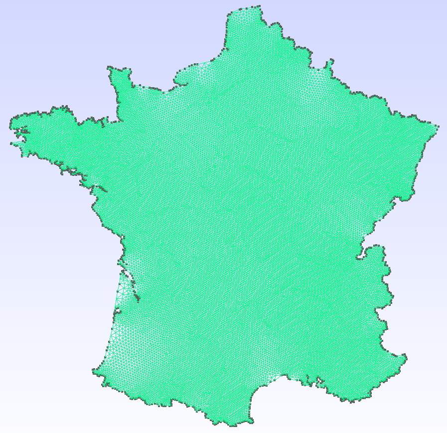
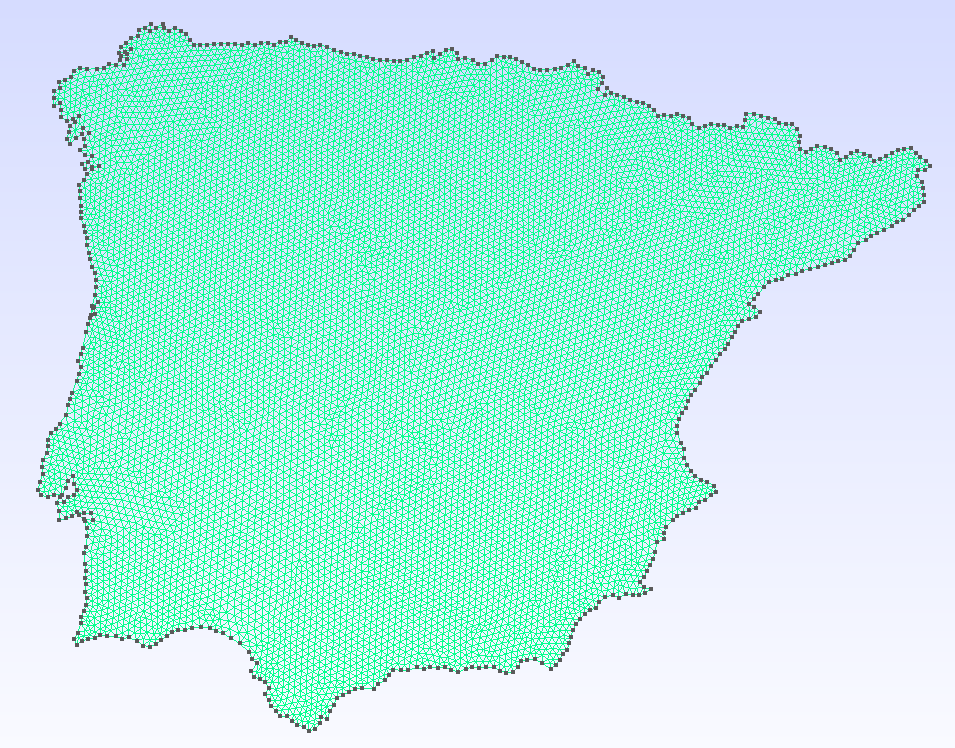
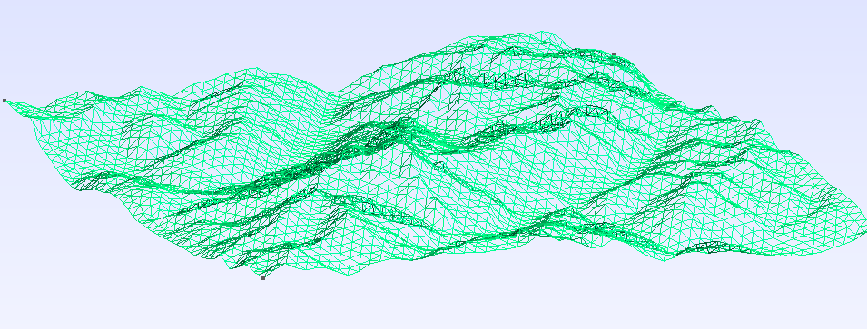
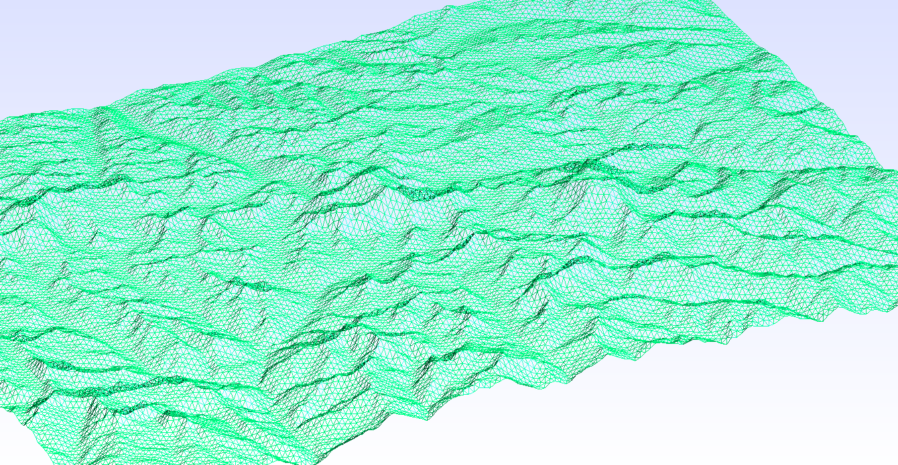

# GeoGmsh.jl

```@docs
GeoGmsh
```

A Julia package that converts geospatial data into Gmsh geometry (`.geo`) and
mesh (`.msh`) files. Accepts any
[GeoInterface](https://github.com/JuliaGeo/GeoInterface.jl)-compatible source:
Shapefiles, GeoJSON, GeoPackage, GeoParquet, NaturalEarth data, or raw
GeoInterface geometries.

---

| | |
|:---:|:---:|
|  |  |
| **France** | **Iberian Peninsula** |
|  |  |
| **Spain** | **Catalonia** |
|  |  |
| **Australia — geometry** | **Australia — mesh** |
|  |  |
| **Mont Blanc (3D terrain)** | **Everest (3D terrain)** |

---

## Features

- **Universal reader** — load any geospatial format (Shapefile, GeoJSON, GeoPackage, GeoParquet, …) through a single [`read_geodata`](@ref) call backed by GDAL.  Read directly from ZIP archives via the `/vsizip/` virtual filesystem.
- **Reproject** — convert between coordinate systems via [GeometryOps.jl](https://github.com/JuliaGeo/GeometryOps.jl) / Proj.jl (e.g. geographic degrees → UTM metres).
- **Simplify** — remove short edges ([`MinEdgeLength`](@ref)), suppress zig-zag spikes ([`AngleFilter`](@ref)), or chain algorithms with `∘` ([`ComposedAlg`](@ref)).
- **Segmentize** — subdivide long edges via `GeometryOps.segmentize` to control maximum element size.
- **Rescale** — normalise geometry into a dimensionless bounding box so `mesh_size` stays consistent across datasets.
- **3D terrain** — lift a 2D mesh to terrain elevation by sampling a DEM raster (GeoTIFF, SRTM, NetCDF, …) at every node.
- **Output** — write a human-readable `.geo` script or call the Gmsh API to produce a `.msh` file directly; linear/quadratic elements and quad recombination supported.

## Installation

```julia
using Pkg
Pkg.add(url = "https://github.com/JordiManyer/GeoGmsh.jl")
```

## Quick start

### From NaturalEarth (no files needed)

```julia
using GeoGmsh, NaturalEarth

countries = naturalearth("admin_0_countries", 110)

geoms_to_msh(countries, "france";
  select       = row -> get(row, :NAME, "") == "France" && row.ring == 1,
  target_crs   = "EPSG:3857",
  simplify_alg = MinEdgeLength(tol = 5_000.0),
  bbox_size    = 100.0,
  mesh_size    = 2.0,
)
# → france.msh
```

### From a file (Shapefile, GeoJSON, …)

```julia
using GeoGmsh

# Inspect available features and rings
list_components("NUTS_RG_01M_2024_4326_LEVL_0.geojson")

# Mesh mainland Germany
geoms_to_msh("NUTS_RG_01M_2024_4326_LEVL_0.geojson", "germany";
  select       = row -> row.NUTS_ID == "DE" && row.ring == 1,
  target_crs   = "EPSG:3857",
  simplify_alg = MinEdgeLength(tol = 10_000.0),
  bbox_size    = 100.0,
  mesh_size    = 2.0,
)
# → germany.msh
```

### 3D terrain mesh

```julia
using GeoGmsh

geoms_to_msh_3d("region.geojson", "dem_utm.tif", "terrain";
  select       = row -> row.NAME == "MyRegion" && row.ring == 1,
  target_crs   = "EPSG:32632",   # must match the DEM CRS
  simplify_alg = MinEdgeLength(tol = 500.0),
  mesh_size    = 500.0,
)
# → terrain.msh  (z-coordinates sampled from DEM)
```

## Pipeline overview

| Step | Function | Purpose |
|------|----------|---------|
| Read | [`read_geodata`](@ref) | Parse any geospatial format; filter by attribute |
| Reproject | `GeometryOps.reproject` | Convert coordinates via PROJ |
| Simplify | [`MinEdgeLength`](@ref), [`AngleFilter`](@ref), [`ComposedAlg`](@ref) | Remove redundant vertices |
| Segmentize | `GeometryOps.segmentize` | Subdivide long edges |
| Ingest | [`ingest`](@ref) | Normalise ring orientation for Gmsh |
| Filter | [`filter_components`](@ref) | Drop degenerate rings |
| Rescale | [`rescale`](@ref) | Normalise into an L × L bounding box |
| DEM | [`read_dem`](@ref), [`lift_to_3d`](@ref) | Sample elevations (3D only) |
| Output | [`write_geo`](@ref) / [`generate_mesh`](@ref) | Write `.geo` or `.msh` |

See the [Pipeline guide](@ref pipeline) and [API reference](@ref api) for details,
or browse the **Examples** section in the sidebar for full worked examples.

## Data sources

The meshes above were generated from the following open datasets:

- **NUTS — Territorial units statistics** (Spain, Catalonia, Navarre, Iberia): Eurostat / GISCO, © European Union.
  [https://ec.europa.eu/eurostat/web/gisco/geodata/statistical-units/territorial-units-statistics](https://ec.europa.eu/eurostat/web/gisco/geodata/statistical-units/territorial-units-statistics)
- **ASGS Edition 3** (Australia): Australian Bureau of Statistics.
  [https://www.abs.gov.au/statistics/standards/australian-statistical-geography-standard-asgs-edition-3](https://www.abs.gov.au/statistics/standards/australian-statistical-geography-standard-asgs-edition-3)
- **Copernicus GLO-30 DEM** (Mont Blanc, Everest, Pyrenees): © DLR e.V. 2010–2014 and © Airbus Defence and Space GmbH 2014–2018. Freely available from the [Copernicus programme](https://spacedata.copernicus.eu/collections/copernicus-digital-elevation-model).
